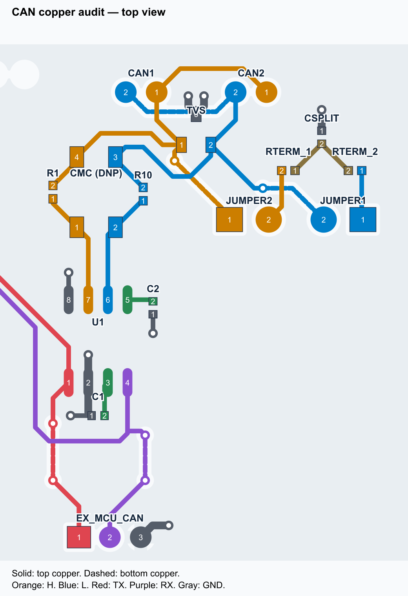

# UM Robocon CAN Platform

An early custom control-board prototype for the **UM Robocon Team**, built to explore communication between STM32 controllers and a transition toward BLDC locomotion. This repository brings together the CAN board design, MCU-to-MCU tests, one- and two-motor VESC firmware, and the hardware debugging that made the bench setup work.

The most useful lesson was not a software fix: intermittent solder contact at the TCAN3413's CANH/CANL leads produced misleading resistance readings and inconsistent measurements. Tracing the signal path with a multimeter and oscilloscope led to the repair.

**Status:** private portfolio draft. STM32-to-STM32 CAN and two unloaded BLDC motors have been demonstrated. Four-wheel locomotion, loaded performance, endurance and EMC have **not** been validated.

## Design

The board combines a TCAN3413 CAN transceiver with an onboard STM32G431RBT6 and connections intended for PWM and encoders. An external-MCU CAN header lets a Nucleo use the transceiver while the onboard MCU is absent or electrically isolated.

The tests use **Classic CAN at 250 kbit/s**. The first application exchanges a ping and reply between a NUCLEO-G474RE and NUCLEO-F303RE. Later applications use VESC extended-ID packets to control BLDC motors and receive electrical-RPM feedback.

```text
MCU-to-MCU test:
G474 → custom transceiver board ═ CANH/CANL ═ custom transceiver board ← F303

Dual-motor test:
Laptop → G474 → custom transceiver board ═ CAN bus ═ VESC ID 1 + VESC ID 2
```

All nodes need a common signal-ground reference. MCU TX connects to transceiver TXD; RX connects to RXD. These are not crossed as UART signals are.



*CAN routing audit, not a fabrication drawing or a photograph of the assembled board.* See [hardware notes](hardware/README.md) and the original [EasyEDA exports](hardware/source).

## Key hardware

| Part | Role |
| --- | --- |
| Custom CAN-Board-V1 | Transceiver, protection, selectable termination, MCU and I/O interfaces |
| TI TCAN3413DR | 3.3 V CAN transceiver |
| Nexperia PESD2CANFD27V-T | Bus ESD protection |
| Two 62 Ω resistors and split capacitor | Selectable split termination, approximately 124 Ω per board |
| R1 and R10, 0 Ω | Separate CANH and CANL bypasses while the CMC is omitted |
| NUCLEO-G474RE / NUCLEO-F303RE | External CAN test controllers |
| Flipsky 6374 190KV motors | BLDC bench-test motors |
| Mini 6.7 and replacement FS75100 | Successful final dual-test ESC pair |

This is a hardware overview, not a complete purchasing BOM. Component values and footprints are in the source exports. The dual-motor bench used a **4S LiPo**; it does not establish a tested 6S robot power system.

## Assembly and debugging

The CAN failures were investigated in stages: power and continuity, firmware execution, internal loopback, external TX/RX, bus termination, and oscilloscope measurements. Aidan reported that the unpowered CANH–CANL resistance changed from approximately **32 kΩ to 60 Ω depending on probe pressure**. Reworking the transceiver lead-to-pad joints restored operation.

This was poor contact between each CAN lead and its own pad—not a short joining CANH to CANL. Read the [debugging case study](docs/debugging.md) for the evidence, limitations and lessons. Separate UART/SWD difficulties are not claimed to have the same proven cause.

## Usage

Choose one firmware application at a time. Building does not flash the MCU, and none of the repository's build tools contacts hardware.

| Application | Target | Purpose |
| --- | --- | --- |
| [g431-uart](firmware/g431-uart) | Custom STM32G431RBT6 | Repeated USART3 output on PC10 at 9600 baud |
| [g474-can-ping](firmware/g474-can-ping) | NUCLEO-G474RE | Standard-ID `0x123` ping every 500 ms |
| [f303-can-reply](firmware/f303-can-reply) | NUCLEO-F303RE | Reply on standard ID `0x124` |
| [g474-vesc-single](firmware/g474-vesc-single) | NUCLEO-G474RE | One VESC, keyboard bench control |
| [g474-vesc-dual](firmware/g474-vesc-dual) | NUCLEO-G474RE | Two VESCs, shared speed request and feedback checks |

Follow [build and use](docs/build-and-use.md) before programming or powering motors. [Protocol notes](docs/protocol.md) explain the IDs, payloads and diagnostic counters.

Motor firmware starts disarmed. Key release requests **zero current and coast**, not active braking. Software timeouts are not a physical emergency stop. Mount motors securely, keep shafts/wheels clear, configure each ESC for its own motor and battery, and provide a physical means of removing motor power.

## Results and current limits

- The G474 internal loopback test passed; this tested the controller internally, not the external pins or transceiver.
- G474–F303 CAN operation was demonstrated after hardware troubleshooting.
- One motor and then two motors were controlled using keyboard requests through the G474.
- The final dual setup reported fresh feedback from both ESC IDs at approximately 50 Hz, with zero reported transmit errors in the recorded bench checks.
- The dual firmware reported 42 startup logic checks passed. These are **not** 42 independent physical motor experiments.
- PWM/encoder operation, precision wheel control, four ESCs, bus stress testing and loaded locomotion remain unverified.

See [verification and evidence](docs/verification.md). Demo videos and annotated measurement captures are pending selection; this draft does not invent missing evidence.

## To do

- [ ] Add selected PCB/assembly photos, scope captures and demo videos.
- [ ] Record repeatable power-off continuity tests after solder rework.
- [ ] Measure termination on the final mixed-ESC bus.
- [ ] Validate PWM and encoder channels on the assembled PCB.
- [ ] Run frame-sequence, command/feedback and disconnect tests with a CAN analyser.
- [ ] Test four independently addressed ESCs before claiming four-wheel operation.
- [ ] Validate wheel encoders, loaded low-speed control, thermal behavior and power distribution.
- [ ] Improve bus pairing/stubs and perform EMC review for the next board revision.
- [ ] Agree on hardware/software licensing before making the repository public.

## Credits

**Aidan — UM Robocon Team:** CAN, PWM and encoder functionality and board requirements; most hardware diagnosis, manual measurements and debugging.

**Rui Leong — UM Robocon Team:** STM32 section design.

**Assembly and soldering:** shared between Aidan and Rui Leong.

AI assistance supported firmware development, documentation and troubleshooting suggestions. Physical probing, measurements, soldering and rework were performed manually by the team. This is a collaborative prototype, not a claim that all firmware was independently handwritten by one contributor.

The clear hardware-project presentation in [bjpirt/shutter-tester](https://github.com/bjpirt/shutter-tester) inspired this repository's organisation; its code and prose were not copied.

No project-wide redistribution license has been selected for this private draft. Existing third-party notices remain in place; see [third-party notices](THIRD_PARTY_NOTICES.md).
