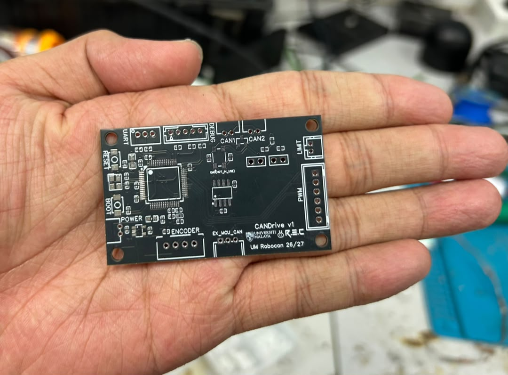
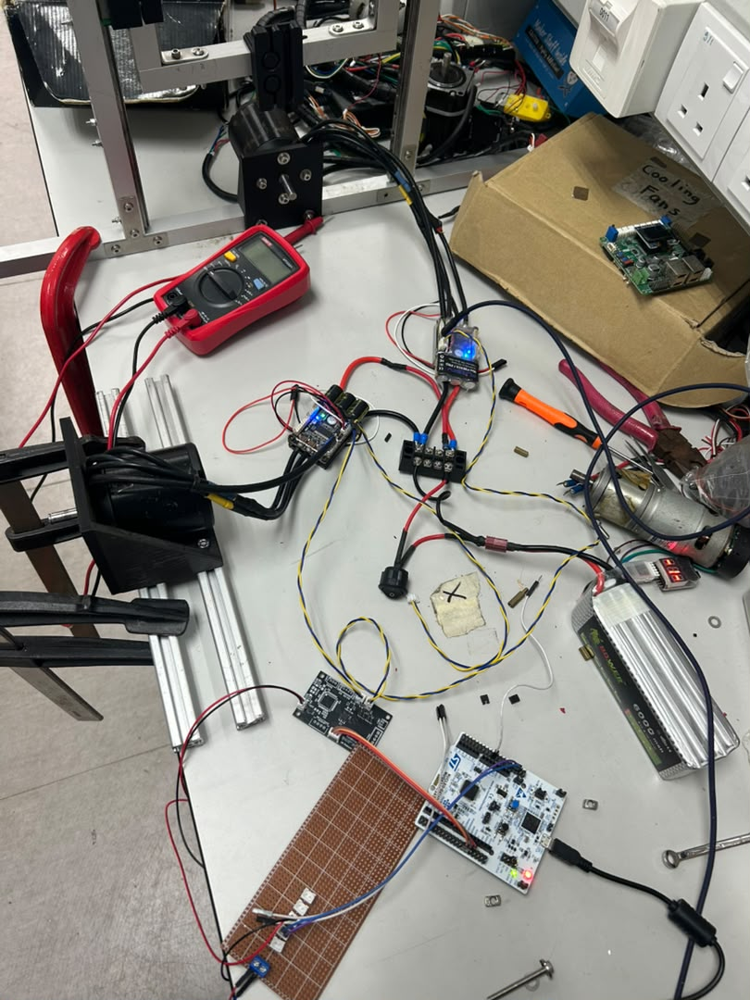
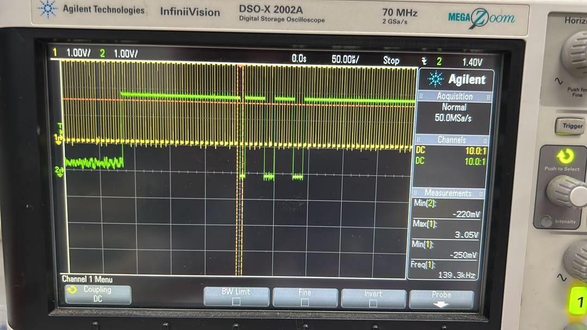
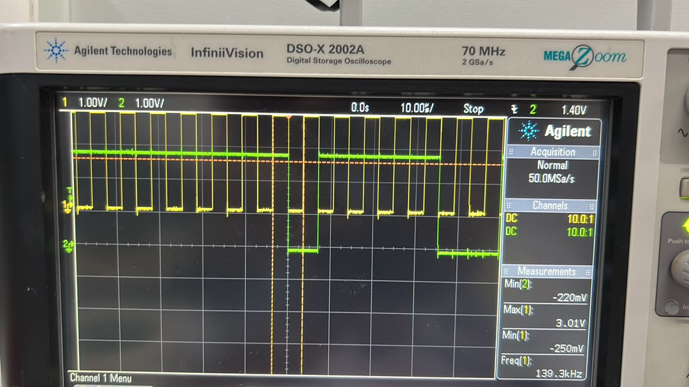
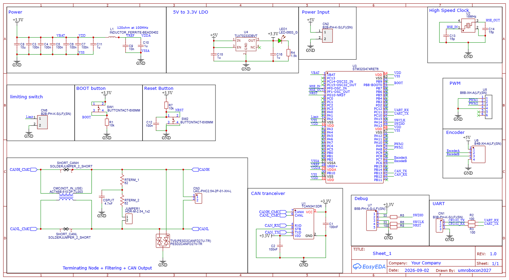

# Prototype and debugging gallery

I added these photographs and the video on 2 October 2026. Original media bytes are retained under descriptive filenames. The supply date and WhatsApp filenames do not independently establish recording dates. Captions distinguish visible observations from the separate test records.

## Complete PCB layout

*Actual EasyEDA capture of the September 27 PCB export, with copper pours hidden for trace visibility. I explain the board's two functions and the header, routing, TVS and CMC trade-offs in [PCB design decisions](pcb-design-decisions.md).*

## CANDrive v1 bare PCB

This photograph shows our bare CANDrive v1 PCB and its labelled interfaces. Note: I still need assembled-board and solder-repair close-ups. PWM and encoder connections are part of the design; I have not validated those channels yet.

## Two-motor bench

I photographed the bench arrangement to show the motors, controllers, custom board and Nucleo. I document the controller identities and observed motor responses separately in my [test notes](verification.md).

### Demonstration video

[Open/download the original bench video](../evidence/videos/bench-demo-supplied-2026-10-02.mp4) — approximately 20.8 seconds, 3.38 MB.

I recorded the motors and wiring, followed by the laptop’s two-motor G474 keyboard-control interface. A 6374 190KV motor label is visible. Note: this is a short demonstration of the setup. I still need independent payload, latency, calibrated speed and loaded-torque measurements. I have not established that the clip matches the timing of the 1 October logs.

The video is preserved with its original audio. Playback support varies by GitHub client; use the file's download option if inline playback is unavailable.

## My SWD debugging captures

In these captures, I probed the debug interface: **CH1/yellow is SWCLK; CH2/green is SWDIO**. Both channels display DC coupling, 10:1 attenuation and 1 V/div.

Wide view at **50 µs/div**. The scope displays CH1 maximum 3.05 V, CH1 minimum −250 mV, CH2 minimum −220 mV and a CH1 frequency reading of 139.3 kHz. These are displayed scope measurements, not independently calibrated values or a guarantee of the programmer's configured clock rate.

Detail at **10 µs/div**. My scope displays a CH1 maximum of 3.01 V, with minima of −250 mV on CH1 and −220 mV on CH2. Note: I captured clock and data transitions without decoding the SWD transactions. I still need to assess the probing and undershoot before drawing conclusions about MCU damage.

Note: I took these captures during the separate debug-interface investigation. I still need CANH/CANL measurements and decoded UART/CAN records to document those signal paths.

## Earlier EasyEDA schematic — design history only

This original export has a filename dated **4 September 2026**. It shows STM32G474RET6 with CAN on PB13/PB12, unlike the later STM32G431RBT6 revision documented in this repository. It is included to show design development, **not as the wiring reference for the current board**.

Use the [27 September EasyEDA source exports](../hardware/source) and [hardware notes](../hardware/README.md) for the documented revision. I reconstructed the [CAN signal-path diagram](../hardware/images/can_routing.png) from that later PCB export to explain the connections; I use the original exports for fabrication.

## Photos and measurements I plan to add

- Close-ups of the assembled PCB and the repaired TCAN3413 lead-to-pad joints.
- Annotated, repeatable CANH/CANL measurements before and after repair.
- Independently decoded CAN frames and repeatable payload/sequence tests.
- Loaded and multi-node testing before making robot-level performance claims.
