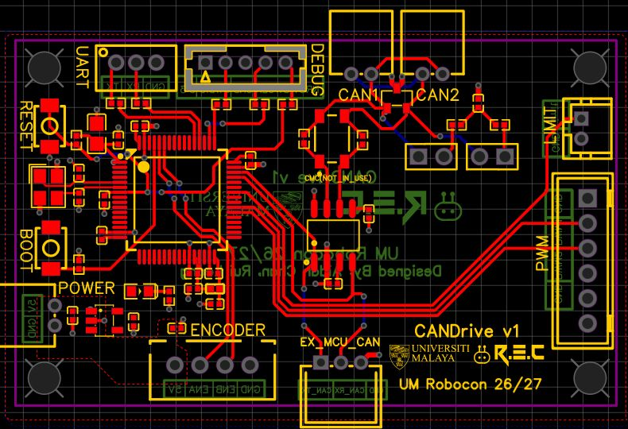

# CANDrive: purpose and PCB design decisions

## Why we built this board

I wanted a robot control board with two complementary functions: local motor control and communication between controller nodes. Rui Leong and I combined them on one PCB so we could develop the motor interface and the CAN network together.

| Part of the board | Intended function | Hardware |
| --- | --- | --- |
| Local controller | Run motor-control logic, send PWM commands to an external motor driver and read encoder feedback | STM32G431RBT6, PWM and encoder headers, limit input, UART and SWD interfaces |
| CAN interface | Connect the controller to a shared bus so nodes can exchange commands and feedback | TCAN3413, CANH/CANL headers, TVS protection, optional CMC and selectable split termination |

The TCAN3413 provides the electrical interface to the bus. The MCU's CAN controller and firmware manage the messages. Each connected MCU node needs a suitable controller/transceiver interface and compatible bus settings. CAN1 and CAN2 connect to the **same bus**, allowing convenient cable connections.

This gives us a path toward distributed robot control: local controllers can handle their motor interfaces while exchanging information over CAN. It also opens a route to CAN-controlled BLDC drivers. Our current BLDC demonstration uses external VESC-compatible ESCs for the motor power stage and an external G474 for control. I still need to validate the integrated onboard G431 path.

## The whole PCB

*Actual EasyEDA editor capture of our September 27, 2026 PCB export, opened on October 4. I hid the copper pours in this view so the traces and component placement are easier to see. The source file is unchanged. This is a design view, not a fabrication or test certificate.*

The MCU section sits on the left, the CAN transceiver and bus interface occupy the centre and upper edge, and the PWM/encoder connectors provide access around the board edges. The EX_MCU_CAN header also let me investigate the transceiver separately with a Nucleo, with the onboard MCU removed or electrically isolated.

## Keeping CANH and CANL together

One of my hardest layout problems was keeping CANH and CANL adjacent with similar path lengths while fitting the transceiver, protection components and connectors into the available space. Moving one component could improve the pair locally but create a longer branch elsewhere.

I worked toward short, closely routed H/L paths with similar bends. I learned to consider pair proximity, layer changes and the return path alongside length mismatch. I did not add long meanders just to make the displayed lengths identical. Note: I have not verified a controlled differential impedance for this PCB or measured a timing penalty from the remaining mismatch.

## Header consistency versus routing freedom

I deliberately kept the two CAN headers in the same physical orientation and pin order to reduce wiring confusion. Rotating one could have made routing easier, but it would have changed how the cables line up. I accepted a routing compromise, including the connector link's different layer paths, to keep that interface consistent.

This was a usability decision with an electrical trade-off. My next revision can revisit connector spacing and the surrounding placement while preserving the clear H/L pin order.

## Vias and component placement

I initially had a CANL detour through the other layer. During the layout iterations, I rotated and repositioned the CMC region so the transceiver-side pair could leave together on the top layer. I also brought the bypass resistors closer to the choke pads to reduce unnecessary branches.

I treated vias as a layout decision: each transition changes the geometry and return path. I tried to avoid repeated or asymmetric layer changes, while keeping ground connections nearby. Note: I have not measured via-related signal degradation, and I do not attribute the later communication fault to the vias. I traced that fault to the transceiver lead-to-pad solder contacts.

## TVS protection and the optional CMC

I included the PESD2CANFD27V-T TVS device for bus transient protection and paid attention to its location near the cable entry and its short ground connection. The layout iterations also added nearby ground vias. The part's low capacitance is relevant to CAN signalling, but I still need system-level protection tests. [Nexperia device datasheet](https://assets.nexperia.com/documents/data-sheet/PESD2CANFD27V-T.pdf).

The CMC footprint gives us an option for common-mode filtering. I had to balance its position against pair routing, TVS placement and the termination branches. For the documented bench setup, I omitted the CMC and fitted the separate 0-ohm bypasses: **R1 for CANH and R10 for CANL**. A fitted CMC uses its two windings instead of those bypasses. Note: the bypassed bench result does not demonstrate the CMC's filtering performance.

I also included selectable split termination using two 62-ohm resistors and a 4.7 nF midpoint capacitor. It lets us configure the board for an endpoint or leave termination disconnected when it sits between other terminated nodes. The transceiver datasheet discusses the layout and optional protection/filtering network, and TI's physical-layer note explains network topology and termination. [TCAN3413 datasheet, section 8](https://www.ti.com/lit/ds/symlink/tcan3413.pdf), [TI CAN physical-layer requirements](https://www.ti.com/lit/an/slla270/slla270.pdf).

## What this work has demonstrated

I demonstrated Classic CAN at **250 kbit/s** between a G474 and F303, followed by control of **two unloaded BLDC motors** through an external G474 and ESCs. I restored communication by reworking the pressure-sensitive solder contacts at the TCAN3413 leads.

**Note: my board still has limits.** I need to validate the onboard G431's CAN and local PWM/encoder functions, CAN FD, a larger loaded motor network and EMC. I also need a CANH/CANL capture with the bitrate and decoding recorded. The supplied scope photographs cover SWCLK/SWDIO during a separate investigation.

## Who did what

I focused on CAN functionality, board requirements, the CAN layout decisions and most hardware diagnosis. Rui Leong designed the MCU section and PWM/encoder functionality. We shared assembly and soldering. The original [design exports](../hardware/source) and [debugging record](debugging.md) accompany this write-up.
