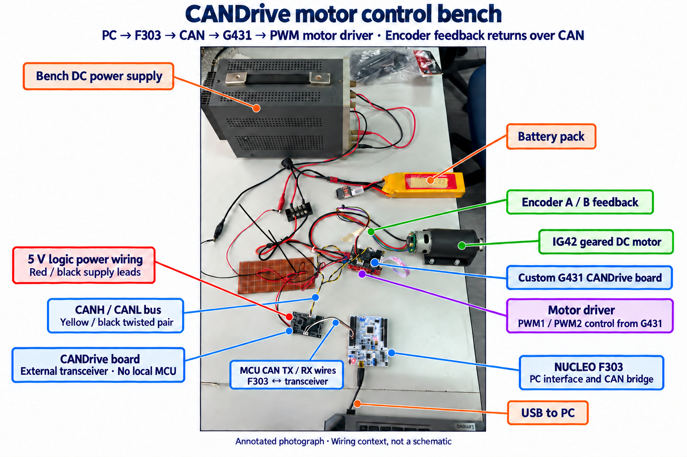

# CAN-based PWM and encoder bring-up

## Milestone — 10 October 2026

The assembled CANDrive prototype now demonstrates keyboard-controlled, bidirectional operation of an IG42 geared DC motor, with live signed encoder position and counts-per-second feedback returned over CAN.

```text
PC control panel
      │ F303 ST-LINK / SWD mailbox
      ▼
NUCLEO-F303RE → CANDrive transceiver board (no local MCU)
                         ║ CANH / CANL
                         ║ Classic CAN, configured at 1 Mbit/s
                         ▼
                 CANDrive with STM32G431

G431 → PWM1 / PWM2 → External motor driver → IG42 motor
G431 ← Encoder A / B ←───────────────────── IG42 encoder
G431 → CAN telemetry → F303 → PC signed encoder display
```

This is open-loop PWM control with measured encoder feedback, **not PID speed or position regulation**. The earlier BLDC/VESC demonstration is a different application.

## Bench setup and demonstrations



The lower CANDrive board provides the F303's external transceiver; its local MCU is not populated. The other CANDrive board uses its onboard G431 for PWM and encoder acquisition. The photo distinguishes MCU-side TX/RX from the yellow/black CANH/CANL pair and the coloured motor-encoder wiring.

The annotation is AI-assisted explanatory media, not a schematic or voltage measurement. The [original photograph](../evidence/pwm-encoder-2026-10-10/bench-setup-original.jpg) is preserved. The 5 V label describes the operator's logic-supply setup, not a visible supply setpoint.

- [Demonstration 1 — motor reversal and encoder display](../evidence/pwm-encoder-2026-10-10/motor-encoder-demo-01-original.mp4), approximately 26.0 seconds.
- [Demonstration 2 — keyboard control and live feedback](../evidence/pwm-encoder-2026-10-10/motor-encoder-demo-02-original.mp4), approximately 14.9 seconds.

Both original video files retain their audio and are not re-encoded. Download them if playback is unavailable. They were supplied on 10 October; their filenames alone do not independently establish recording time or synchronisation with the diagnostic logs.

In the clearer first clip, the shaft marker changes orientation while the panel reports signed motion: approximately **−530 counts/s** in one direction and **+540 counts/s** in the other. The accumulated count decreases and increases accordingly. Stopped portions show zero counts/s and a held position. These are approximate readings from filmed GUI frames, not calibrated shaft-speed measurements or a per-edge audit.

## What was tested, and how

| Check | Method | Observed result and scope |
| --- | --- | --- |
| Onboard G431 CAN application | F303/G431 telemetry and heartbeat at configured 1 Mbit/s, followed by a 35-second stopped-control worker | 288 live samples; 27,010 additional RX frames and 1,687 complete snapshots between first/last samples; zero recorded worker faults or RX/FIFO/queue losses |
| Independent G431 status | Read G431 runtime and controller registers through its debugger after the stopped-control worker | ECR zero, fault zero, disarmed, both PWM duties zero and STOP acknowledged |
| Bidirectional motor and encoder demonstration | Inspect supplied videos showing keyboard operation, shaft marker and PC feedback | Positive and negative encoder motion demonstrated; stopped readings settle to zero counts/s |
| Host protocol and keyboard logic | Run the archived Python unit tests using mocked hardware | 26 tests passed; includes signed decoding, coherent snapshots, stale-feedback guards, command limits, key release/focus loss and reversal handling |

The initial paired inspection retained a startup controller event during sequential resets before the application qualified the live bus. Do not describe the whole bring-up history as fault-free. Earlier encoder tests also produced poor counts; those records remain available rather than being overwritten by the later demonstration.

The [evidence index](../evidence/pwm-encoder-2026-10-10/README.md) separates these short CAN checks, earlier encoder diagnostics, later video observations and offline tests. No new hardware experiment was run while preparing this update.

## Programming configuration

### CAN and commands

Both endpoints use eight-byte, standard-ID Classic CAN frames. At 1 Mbit/s, F303 uses a nominal 32 MHz CAN clock and prescaler 2; G431 uses 16 MHz and prescaler 1. Both use 16 time quanta: sync 1 + BS1 11 + BS2 4, a 75% sample point and SJW 4.

```text
bitrate = CAN clock / [prescaler × (1 + BS1 + BS2)]
F303: 32,000,000 / (2 × 16) = 1,000,000 bit/s
G431: 16,000,000 / (1 × 16) = 1,000,000 bit/s
```

The private application uses ID `0x320` for commands, `0x321` for heartbeat and `0x330` for telemetry, with little-endian fields. A command carries opcode, channel, 16-bit value and 32-bit sequence. Duty uses permille: 50 = 5%, 100 = 10%. Command acknowledgement and result are checked separately from CAN enqueue success. This is not yet a four-node addressing scheme.

The host retains frequency and duty tuning. Hold Up selects PWM1; hold Down selects PWM2 after manual arming and enabling keyboard control. Release requests zero duty; focus loss/Escape stops or disarms. Direction depends on the driver wiring. Software interlocks are not a physical emergency stop.

### Encoder and calculations

G431 PB7 is encoder A/TIM4_CH2; PB6 is B/TIM4_CH1. **TIM4 TI1+TI2 encoder mode** performs x4 quadrature counting; this is one timer with two inputs, not TIM1 plus TIM2. PWM1 is PC7/TIM3_CH2 and PWM2 is PC6/TIM3_CH1.

The selected G431 build enables internal pull-ups on PB6/PB7 using `IG42_ENCODER_PULLUPS=1`. Its source defaults to pull-ups **off** if that build flag is omitted. The current equal A/B filter setting is `ENCODER_INPUT_FILTER=15`; its high-speed counting limit has not been qualified. Neither software filtering nor continuity proves powered signal integrity, and a 5 V encoder supply does not by itself establish a safe pull-up voltage.

The 16-bit TIM4 counter is extended into signed accumulated position by taking each modular counter delta as a signed difference. Correct wrap handling requires fewer than 32,768 net counts between samples. Speed uses position change over the measurement window:

```text
counts/s = Δposition × 1000 / elapsed_ms
RPM = counts/s × 60 / calibrated decoded counts per revolution
```

The IG42's reported “480 signals/revolution” has not been resolved into a calibrated x4 count at a defined shaft. Do not assume 480 versus 1,920, or publish calibrated RPM yet. Direction sign also depends on A/B wiring and the shaft-viewing convention.

## Remaining limits

- No known-revolution calibration, missed-edge audit, high-speed qualification or calibrated RPM/position accuracy.
- No PID control, loaded torque validation, four-wheel locomotion or C620 protocol demonstration.
- G431 currently has an operator-observed ST-LINK/connect/reset dependency. The debugger is not part of its CAN control protocol; independent powered cold-start operation remains unresolved.
- The earlier G474/F303 30-minute, 5.3-million-pair endurance test used external Nucleos. It does **not** qualify this onboard G431 motor-control application. This control firmware disables automatic retransmission, unlike that earlier test firmware.
- Internal-oscillator voltage/temperature tolerance, noisy harness operation and independent CANH/CANL waveforms remain unqualified. A programmer reported about 2.89 V for the G431 reference during an earlier check; that is not an independent measurement of its nominal 3.3 V rail.
- Source snapshots are provided for review, not as a new turnkey firmware release. A snapshot/hash taken at publication preparation does not independently identify the precise binaries running in each supplied video.

The next useful milestone is calibrated counts per output-shaft revolution in both directions, followed by repeatable speed measurements and cold-start operation without the G431 debugger.
