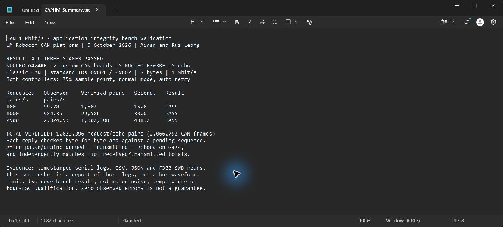
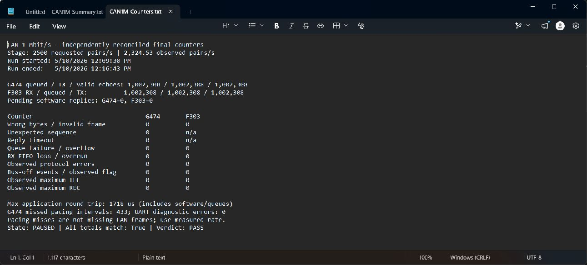

# 1 Mbit/s Classic CAN bench validation — 5 October 2026

All three recorded stages passed the defined application-integrity criteria.

| Requested pairs/s | Observed pairs/s | Verified pairs | Run seconds | Max round trip (us) | Missed pacing intervals | Verdict |
| ---: | ---: | ---: | ---: | ---: | ---: | --- |
| 100 | 99.78 | 1502 | 15.028 | 1653 | 0 | PASS |
| 1000 | 984.35 | 29586 | 30.031 | 408 | 29 | PASS |
| 2500 | 2324.53 | 1002308 | 431.16 | 1718 | 433 | PASS |

Across completed stages: **1,033,396 byte-validated request/echo pairs**, equivalent to 2,066,792 successfully delivered Classic CAN data frames.

## Method and pass criteria

G474 sends standard-ID 0x601 eight-byte frames. F303 echoes exactly those eight bytes on ID 0x602. Bytes 0–3 are a big-endian sequence; bytes 4–7 rotate through zeros, ones, alternating 0x55/0xAA, sequence-derived and deterministic mixed patterns. G474 checks the full reply against the expected payload and outstanding sequence. CAN normal-mode automatic retransmission is enabled; this is not internal loopback.

The G474 is paused between stages. F303 is reset and its baseline counters checked over SWD. Each stage starts with reset G474 counters. After the run, G474 is paused, queued replies are allowed to drain, and independent F303 counters are read without resetting the board. Pass requires equal nonzero G474 queued/completed/validated-echo totals, matching F303 received/queued/completed totals, no pending replies, and zero recorded payload, sequence, timeout, FIFO, queue, protocol, bus-off and observed maximum TEC/REC faults on both sides. Diagnostic UART errors must also be zero.

## Results and limitations

Use measured throughput, not the configured rate. The G474 firmware runs at 16 MHz and builds an interrupt-driven UART status report once per second; the achieved request rate is below the requested high-load setting. Its `late` counter counts missed scheduling intervals, not dropped or corrupted CAN frames. It is not grounds for claiming exact 2,500 pairs/s sustained throughput. The application round-trip maximum includes software execution and mailbox/queue latency; it is not a measured transceiver propagation delay or a motor response time.

This is a two-node bench test through the user-built transceiver boards. It does not qualify four physical ESC nodes, a complete robot harness, motor-switching noise, long cables, environmental conditions or EMC. Both MCUs use internal oscillators; clock tolerance across voltage/temperature was not tested. Cable length and ambient temperature were not measured. Earlier termination was reported by the user near 60 ohms, not independently remeasured during this run. A pass means no faults were observed by the stated application checks and controller counters under these conditions; it does not prove that every analogue edge is ideal or that the error probability is literally zero.

There was one aborted host-side preflight before the 1,000-pair/s stage: buffered PAUSED reports from the prior stage were accepted before the new rate was confirmed. The host script was corrected to wait for the expected rate and zero queued count. The preflight evidence is retained under `stage-1000-preflight1-*`; no RUN command was sent in that aborted attempt. Firmware was not changed or reflashed during this validation.

The first two PAUSED reports in `stage-100-serial.txt` also record `uart_err=1` before the test counters were reset and RUN began. The underlying UART cause was not established; RUN and final records have `uart_err=0`. This preparatory diagnostic is retained and is distinct from CAN errors during the completed stages.

See [firmware/commit provenance](../../docs/firmware-provenance.md) and the [combined verification report](../../docs/verification.md). The exact 1 Mbit/s BIN hashes were reproduced offline from the committed overlays. No flash-time Git commit was recorded; the source was archived afterward. The onboard G431 was not the controller under test.

## Evidence files

Build overlays and rerun instructions: [reproduction guide](REPRODUCTION.md). Offline reproduction produced byte-identical firmware binaries to the tested builds; see the guide for the hashes.

### Recorded-results screenshots

These are unedited native screenshots of reports generated from the recorded stage results, not live bus traces.

- `manifest.json`: firmware SHA-256 hashes and nominal controller configuration.
- `stage-*-serial.txt`: raw G474 status messages with host receipt timestamps; approximately one report per second, not a per-frame CAN capture.
- `stage-*-samples.csv`: parsed diagnostic samples.
- `stage-*.json`: reconciled final stage totals, observed throughput and pass criteria.
- `stage-*-f303-before.txt` / `after.txt`: independent SWD memory reads. Probe serial numbers are removed from these published copies.
- `CAN1M-Summary.txt` / `CAN1M-Counters.txt`: readable reports generated from the stage JSON, for screenshot capture. Screenshots are report-viewer captures, not oscilloscope or CAN-analyser traces.
- `live-progress.txt`: complete read-only-terminal progress history, including the aborted preflight.

Follow-up work: higher-clock or hardware-timed pacing, independent analyser/oscilloscope captures, repeated cold starts, cable-length testing, and multi-node/noisy motor-operation tests. The synthetic IDs used here are not VESC or C620 motor commands.
