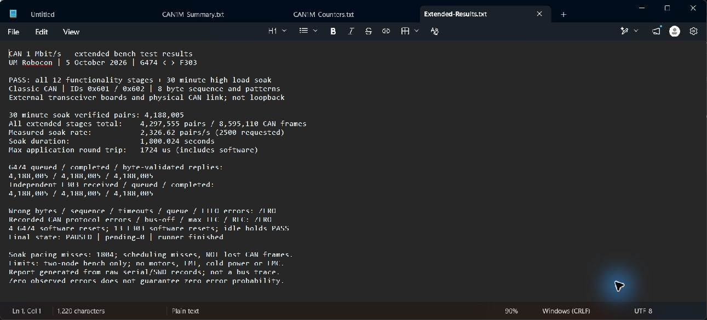

# Extended 1 Mbit/s Classic CAN validation — 5 October 2026

**PASS:** 12 short functionality stages and a 30-minute high-load soak through the external-MCU transceiver-board setup.

The soak verified **4,188,005 eight-byte request/echo pairs**; the complete extended suite verified **4,297,555 pairs / 8,595,110 delivered CAN data frames**. All 13 stages reconciled G474 queued/TX/validated-reply totals against independently read F303 RX/queued/TX totals, with no pending replies or recorded data, sequence, timeout, queue, FIFO or controller errors.

## Test method

The existing firmware sends standard-ID 0x601 eight-byte frames containing a four-byte sequence and changing four-byte patterns (zeros, ones, 0x55, 0xAA and sequence-derived/mixed patterns). F303 echoes all eight bytes using ID 0x602. G474 checks every reply byte and its outstanding sequence; strict reply ordering within the outstanding window is not asserted. Both controllers use normal mode at 1 Mbit/s with automatic retransmission; the firmware is unchanged from the earlier validation.

Four G474 software-reset cycles each include short runs at requested 100, 1,000 and 2,500 pairs/s. Each of the 13 stages resets F303 only while G474 is paused and checks its zero baseline. After each run, queued traffic drains, G474 remains paused for 3 seconds (5 after the soak), and its counters must remain unchanged with zero pending replies. Final F303 counters are independently read over SWD. Start commands restart the CAN test and reset its sequence/counters; this is not sequence-preserving resume. These are software resets, not cold power cycles.

## Recorded stages

| Stage | Requested pairs/s | Observed pairs/s | Verified pairs | Run seconds | Verdict |
| --- | ---: | ---: | ---: | ---: | --- |
| cycle-1-rate-100 | 100 | 100.19 | 801 | 8.01 | PASS |
| cycle-1-rate-1000 | 1000 | 986.61 | 7916 | 8.019 | PASS |
| cycle-1-rate-2500 | 2500 | 2326.64 | 18661 | 8.017 | PASS |
| cycle-2-rate-100 | 100 | 87.07 | 801 | 8.002 | PASS |
| cycle-2-rate-1000 | 1000 | 984.77 | 7928 | 8.033 | PASS |
| cycle-2-rate-2500 | 2500 | 2325.5 | 18672 | 8.022 | PASS |
| cycle-3-rate-100 | 100 | 99.97 | 803 | 8.026 | PASS |
| cycle-3-rate-1000 | 1000 | 986.84 | 7924 | 8.029 | PASS |
| cycle-3-rate-2500 | 2500 | 2323.54 | 18673 | 8.025 | PASS |
| cycle-4-rate-100 | 100 | 100.04 | 802 | 8.018 | PASS |
| cycle-4-rate-1000 | 1000 | 984.65 | 7927 | 8.031 | PASS |
| cycle-4-rate-2500 | 2500 | 2328.07 | 18642 | 8.011 | PASS |
| soak-2500 | 2500 | 2326.62 | 4188005 | 1800.024 | PASS |

## Interpretation and limits

The 30-minute run lasted 1800.024 seconds and achieved approximately **2326.62 pairs/s**, not exactly the requested 2,500. Its **1804 missed pacing intervals** are firmware scheduling misses, not missing CAN frames. Maximum application round trip was 1724 microseconds, including software/queues, not transceiver propagation delay or motor response time.

Observed rates are estimates using host receipt timestamps of roughly once-per-second serial reports; buffering affects short-stage estimates (notably cycle-2-rate-100). Byte counts and final independent reconciliations are the integrity evidence. No per-frame bus capture is included.

The [combined verification report](../../docs/verification.md) derives approximately **51.65–62.82% successful-frame bus occupancy** from achieved throughput and an assumed 111–135 bits per standard eight-byte frame including intermission. This is an estimate, not measured utilisation. That report also explains DWT-based round-trip timing and internal-oscillator limitations. The onboard G431 was not the CAN controller under test.

[Firmware provenance](../../docs/firmware-provenance.md) maps both datasets to the reproduced image hashes, the source archive commit and the `v0.2.0-bench-validation` release. The source was committed after testing; no flash-time Git commit is invented.

This is a two-node room-temperature bench result, not qualification for four ESCs, a complete robot harness, motor-switching noise, environmental extremes or EMC. Cable length and temperature were not measured. Both MCUs use internal oscillators; their tolerance across voltage/temperature was not tested. Earlier termination near 60 ohms was reported by the user, not independently remeasured for this test. No motors were commanded, no components or wiring were changed, and no physical fault injection or cold power cycling was performed. Zero recorded errors is not an absolute guarantee.

## Provenance and evidence

A host-script syntax error prevented the first runner launch before any hardware access. It was corrected before the successful suite; the private original launch/error logs remain in the local run directory and are omitted from the publication bundle because they contain host paths. No hardware fault was retried or cleared.

- `suite.json`: final stage summary and fresh PAUSED confirmation.
- `verification-audit.json`: all 13 final records checked against their raw serial and before/after SWD records.
- `cycle-*/` and `soak-2500/`: raw timestamped serial logs, diagnostic CSV, JSON verdict and independent F303 reads.
- `cycle-*-g474-reset.txt`: G474 software-reset records, with probe serial numbers removed.
- `final-pause-serial.txt`: final stopped-state report; `live-progress.txt`: suite progress.
- `baseline-firmware-identification.json`: earlier tested firmware hashes and nominal configuration; its timestamp belongs to that earlier run.
- `tools/`: exact host test scripts used; probe identifiers are supplied by the operator as parameters.
- `Extended-Results.txt`: generated report for the unedited screenshot below, not an oscilloscope or CAN-analyser trace.

## Reproduce

Use the [earlier source overlays and binary-reproduction procedure](../can-1mbit-2026-10-05/REPRODUCTION.md) for the same firmware. With those binaries already flashed to the correct boards, run `tools/run-lunch-suite.ps1` in PowerShell 7 with a new `-RunDirectory`, the installed `-Programmer` path, your explicit `-G474Serial` and `-F303Serial`, the G474 diagnostic `-Port`, and `-SoakSeconds 1800`. This contacts hardware, starts synthetic traffic and performs MCU software resets; disconnect motor controllers first. Do not run a second serial client or test runner concurrently.

The runner stops on detected faults or a `STOP` file in its run directory, attempts to pause in its cleanup, and records final stop confirmation. Keep power/USB/computer available; abrupt host loss can prevent cleanup. This is not a physical emergency stop. AI assisted firmware/host diagnostics and evidence preparation; Aidan performed the hardware assembly diagnosis and measurements.
